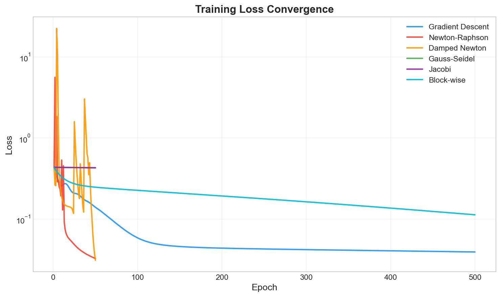
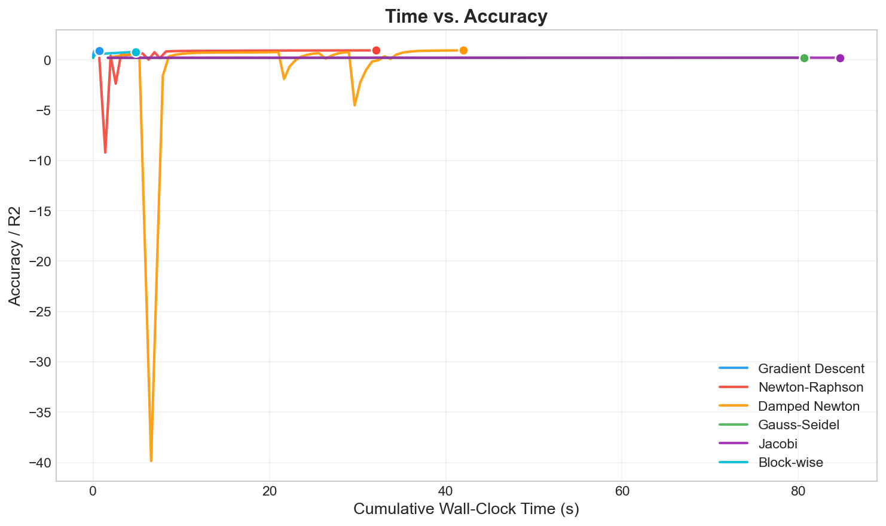
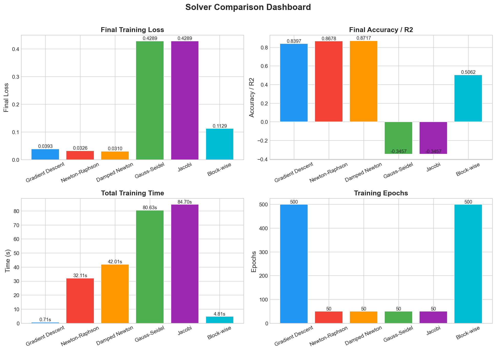
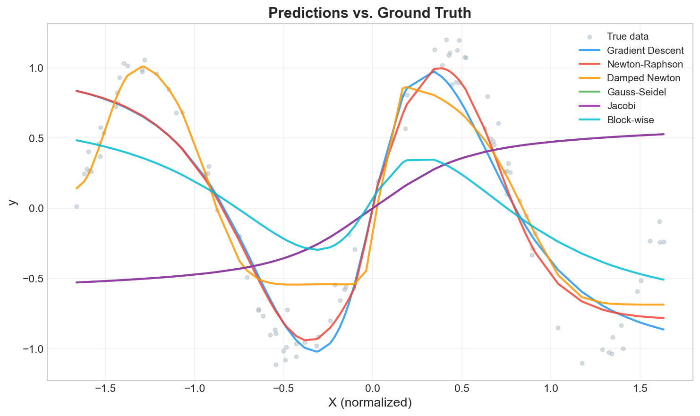
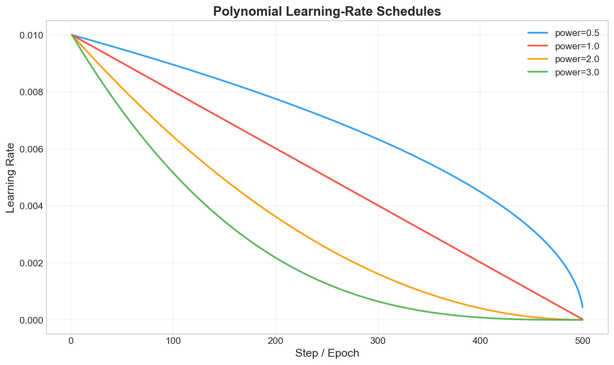
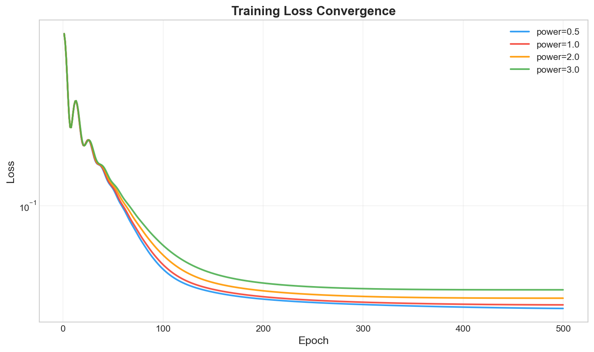

# Hybrid Numerical Neural Network

> Implemented a numerical methods integrated neural network from scratch — developed hybrid weight update strategies using **Gauss-Seidel**, **Newton-Raphson**, **Jacobi**, and **block-wise iterative methods**. Incorporated **polynomial learning rate** scheduling to study convergence dynamics and stability across different solvers. Compared gradient-based and classical numerical methods evaluating cost, convergence speed, and model accuracy. Built entirely with NumPy.

---

## Motivation

Modern deep learning frameworks abstract away the optimization process behind a single `optimizer.step()` call. This project peels back that abstraction and asks: **what if we trained neural networks using classical numerical methods from scientific computing?**

By implementing and benchmarking six fundamentally different solvers on the same network and dataset, this project explores:

- **First-order vs. second-order convergence** -- how curvature information (the Hessian) accelerates training.
- **Direct vs. iterative linear solvers** -- trade-offs between Gauss-Seidel (sequential) and Jacobi (parallelizable) for solving the Newton system.
- **Computational cost vs. accuracy** -- why modern deep learning favors first-order methods despite their slower convergence.
- **Learning rate scheduling** -- the impact of polynomial decay schedules on training stability and final accuracy.

---

## Key Results

All six solvers were evaluated on a synthetic sine-wave regression task using a `[1, 16, 8, 1]` MLP with `tanh` activation:

| Solver | Epochs | Final Loss | Test R2 | Wall-Clock Time |
|:---|:---:|:---:|:---:|:---:|
| Gradient Descent | 500 | 0.039 | 0.840 | **0.59s** |
| Newton-Raphson | 50 | 0.033 | 0.868 | 28.70s |
| Damped Newton | 50 | **0.031** | **0.872** | 29.23s |
| Block-wise | 500 | 0.113 | 0.506 | 1.66s |
| Gauss-Seidel | 50 | 0.429 | -0.346 | 30.63s |
| Jacobi | 50 | 0.429 | -0.346 | 29.58s |

**Key Insight:** Second-order methods (Newton, Damped Newton) achieved lower loss in just 50 epochs compared to GD's 500, but at ~50x the wall-clock cost per epoch due to O(N^2) Hessian computation. This perfectly illustrates why production deep learning uses first-order optimizers (SGD, Adam) or quasi-Newton approximations (L-BFGS).

### Convergence Curves



### Time vs Accuracy Trade-off



### Solver Comparison Dashboard



### Prediction Quality



### Learning Rate Schedule Analysis





---

## Project Architecture

```
numerical-optimization-nn/
|
|-- core/                          # Neural network engine
|   |-- network.py                 # MLP: forward, backward, Hessian computation
|   |-- activations.py             # ReLU, Sigmoid, Tanh, Softmax, Linear
|   |-- losses.py                  # MSE, Cross-Entropy with analytical gradients
|   |-- initializers.py            # He, Xavier, Random initialization
|   |-- __init__.py
|
|-- solvers/                       # Optimization algorithms
|   |-- gradient_descent.py        # SGD with momentum
|   |-- newton_raphson.py          # Newton-Raphson + Damped Newton
|   |-- gauss_seidel.py            # Gauss-Seidel iterative solver
|   |-- jacobi.py                  # Jacobi iterative solver
|   |-- block_iterative.py         # Block-wise coordinate descent
|   |-- __init__.py
|
|-- schedulers/                    # Learning rate scheduling
|   |-- polynomial_lr.py           # Polynomial decay: lr * (1 - t/T)^p
|   |-- __init__.py
|
|-- utils/                         # Utilities
|   |-- data_loader.py             # Synthetic dataset generation
|   |-- metrics.py                 # MSE, R2, Accuracy computation
|   |-- visualization.py           # Publication-quality plotting
|   |-- __init__.py
|
|-- experiments/
|   |-- run_experiments.py         # Main experiment entry point
|   |-- __init__.py
|
|-- results/                       # Generated plots (auto-created)
|-- config.py                      # Centralized hyperparameters
|-- requirements.txt
|-- README.md
```

---

## Solvers Implemented

### 1. Gradient Descent (with Momentum)
Standard first-order optimizer. Update rule: `v = momentum * v - lr * grad; W += v`

### 2. Newton-Raphson
Pure second-order method. Solves `H * delta = grad` using the full Hessian matrix, then updates `params -= lr * delta`. Uses Tikhonov regularization (`H + lambda * I`) for numerical stability.

### 3. Damped Newton
Newton-Raphson with a reduced step size (lr < 1.0) to improve stability on non-convex loss surfaces while retaining curvature information.

### 4. Gauss-Seidel
Iterative linear solver that solves the Newton system `H * x = g` without direct matrix inversion. Updates parameters **sequentially**, immediately using the latest computed values. Requires diagonal dominance of the regularized Hessian for convergence.

### 5. Jacobi
Similar to Gauss-Seidel but updates all parameters **simultaneously** using values from the previous iteration. Naturally parallelizable -- demonstrates the sequential vs. parallel trade-off in iterative methods.

### 6. Block-wise Iterative
Coordinate-descent variant that treats each layer as a "block." Optimizes one layer at a time while freezing others, cycling through the entire network. Essentially Gauss-Seidel at the layer level.

---

## Getting Started

### Prerequisites

- Python 3.8+

### Installation

```bash
git clone https://github.com/<your-username>/hybrid-numerical-neural-network.git
cd hybrid-numerical-neural-network
pip install -r requirements.txt
```

### Run Experiments

```bash
python -m experiments.run_experiments
```

This will:
1. Train all six solvers on a synthetic sine-wave regression task.
2. Compare convergence speed, wall-clock time, and R2 on held-out test data.
3. Save six publication-quality plots to `results/`.
4. Print a summary comparison table to the console.

### Configuration

All hyperparameters are centralized in [`config.py`](config.py):

```python
NETWORK_CONFIG = {
    "layer_sizes": [2, 16, 8, 1],
    "activation": "tanh",
    "loss": "mse",
    "initializer": "he",
}
```

---

## Technical Highlights

- **Pure NumPy** -- no PyTorch/TensorFlow. Every gradient, every matrix operation, every activation function is implemented from first principles.
- **Finite-Difference Hessian** -- the full N x N Hessian is computed via centered finite differences for second-order solvers.
- **Modular Solver Interface** -- all solvers implement a unified `step(network, X, y) -> loss` API, making them interchangeable.
- **Polynomial LR Scheduling** -- `lr(t) = lr_0 * (1 - t/T)^p` with configurable power `p` for comparative analysis.

---

## Tech Stack

| Component | Technology |
|:---|:---|
| Core computation | NumPy |
| Visualization | Matplotlib |
| Data preprocessing | scikit-learn |
| Language | Python 3.8+ |

---

## License

This project is open-source and available under the [MIT License](LICENSE).
